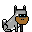

# ordpunkd - (Zero-Config) Art Base Server for Ordinal Punks Fam & Frens

ordpunkd - zero-config web server / services; (auto-)downloads & serves pre-configured pixel art collections "out-of-the-box"; incl. 2x/4x/8x zoom for bigger image sizes and more; binaries for easy "xcopy" installation for windows, linux & friends


## Download Binaries For Easy "Xcopy" Installation

Find the archives to download  - about 3 Megabytes (MB) - for Windows, Linux and Friends at the [**Releases Page »**](https://github.com/ordinalpunks/ordinalpunks.server/releases).

Unpack the archive (e.g. `ordpunk-*.tar.gz` or `ordpunk-*.zip`) and than start / run the binary:

```
$ ordpunkd
```

This will start-up a (web) server (listening on port 8080). To test open up `http://localhost:8080` in your browser (to get the index web page listing all collections).


## Build & Run From Source


Use / issue / type  (in the `/ordinalpunks.server` directory):

```
$ go build ordpunkd.go
```

to get a zero-config x-copy binary for your operation system / architecture.
To run use:

```
$ ordpunkd
```

This will start-up a (web) server (listening on port 8080). To test open up `http://localhost:8080` in your browser (to get the index web page listing all collections).


## Ordinal Punks Fam & Frens - The Server Edition

The ordpunk (web) server will (auto-)download on demand the first-time only pre-configured
pixel art collections (using all-in-one image composites)
to your working directory and use the "cached" version from the next time on (incl. server restarts).


The ordinal punk fam & frens pixel art collections pre-configured¹ include:


- [punks](https://github.com/ordbase/ordinals.sandbox/blob/master/i/ordinalpunks.png) (24x24)
- [phunks](https://github.com/ordbase/ordinals.sandbox/blob/master/i/ordinalphunks.png) (24x24)
- [lilphunks](https://github.com/ordbase/ordinals.sandbox/blob/master/i/lilordinalphunks.png) (24x24)
- [doggies](https://github.com/ordbase/ordinals.sandbox/blob/master/i/ordoggies.png) (32x32)
- [greenbacks](https://github.com/ordinalpunks/ordinalpunks.sandbox/blob/master/dollar/i/dollars.png) (54x28)
- [orangepilled](https://github.com/ordinalpunks/ordinalpunks.sandbox/blob/master/orangepill/i/orangepilled_ii.png) (24x24)
- [goldcoins](https://github.com/ordinalpunks/ordinalpunks.sandbox/blob/master/coins/i/goldcoins.png) (32x32)
- [sketches](https://github.com/ordinalpunks/ordinalpunks.sandbox/blob/master/sketch/i/sketches.png)  (49x49)
- [neons](https://github.com/ordinalpunks/ordinalpunks.sandbox/blob/master/neon/i/neons.png) (49x49)
- [polaroids](https://github.com/ordinalpunks/ordinalpunks.sandbox/blob/master/polaroid/i/polaroids.png)  (34x38)
- And more


¹: see [collections.csv](collections.csv)


Bonus: For more see the [**Ordinal Punks Sandbox** »](https://github.com/ordinalpunks/ordinalpunks.sandbox)


### (Web) Services


To get pixel art images, use `/:name/:id[.png|.svg]`.

Let's try the (default)
binary raster graphics format
using the portable network graphics (.png) encoding.
Example:

`/greenbacks/0`, `/greenbacks/1`, `/greenbacks/2`,
(same as `/greenbacks/0.png`, `/greenbacks/1.png`, `/greenbacks/2.png`) ...


or `/goldcoins/0`, `/goldcoins/1`, `/goldcoins/2`,
(same as `/goldcoins/0.png`, `/goldcoins/1.png`, `/goldcoins/2.png`)  ...


Note / Tip:   For now all collections here start ids / numbers with zero (0) NOT one (1).
If you are using official punk ids / numbers - starting with one (1) -
than subtract one¹ from the id e.g. use 65 for 66, 66 for 67, ..., 0 for 1, 99 for 100 and so on.

¹: Note: Only if the collection here is listed with a count of a hundred (100) and NOT a hundred and one (101).


Let's try the scalable vector graphics (.svg) format in text.
Example:


`/greenbacks/0.svg`, `/greenbacks/1.svg`, `/greenbacks/2.svg`, ...


or `/goldcoins/0.svg`, `/goldcoins/1.svg`, `/goldcoins/2.svg`,  ...


Note: Pixels get "encoded" as rectangle "shapes" with a width and height
of one (1×1).  Transparent pixels
with the red/green/blue/alpha (rgba) value of (0 or 0/0/0/0)
get dropped.


#### z (zoom) Parameter - 2x, 4x, 8x, 10x, 20x ...   (.png only)


Note: The default image size is the default
(minimum) pixel size of the collection e.g. 24x24 for punks.
Use the z (zoom) parameter to upsize.

Let's try 2x:


`/greenbacks/0.png?z=2`, `/greenbacks/1.png?z=2`, `/greenbacks/2.png?z=2`, ...


or `/goldcoins/0.png?z=2`, `/goldcoins/1.png?z=2`, `/goldcoins/2.png?z=2`, ...


Let's try 8x:


`/sketches/0.png?z=8`, `/sketches/1.png?z=8`, `/sketches/2.png?z=8`, ...


or `/neons/0.png?z=8`, `/neons/1.png?z=8`, `/neons/2.png?z=8`, ...  And so on.


#### bg (background) Parameter    (.png only)

Let's try adding the classic orange background
in red/green/blue (rgb) hexcode `#ff9900`.
Use the bg (background) parameter:

`/punks/0.png?bg=ff9900`, `/punks/1.png?bg=ff9900`, `/punks/2.png?bg=ff9900`, ...

.png)
.png)
.png)


#### silhouette Parameter    (.png only)

Let's try a black silhouette.
Use the silhouette parameter:

`/punks/0.png?silhouette=black`, `/punks/1.png?silhouette=black`, `/punk/2.png?silhouette=black`, ...

.png)
.png)
.png)


#### Bonus -  Glory to Ukraine! Fuck (Vladimir) Putin! Stop the War! - Send A Stop The War Message To The World With Your Profile Picture


Let's try two-colored with the background in blue
and the silhouette (foreground) in yellow:

`/punks/0.png?bg=ukraineblue&silhouette=ukraineyellow`, `/punks/1.png?bg=ukraineblue&silhouette=ukraineyellow`, `/punks/2.png?bg=ukraineblue&silhouette=ukraineyellow`, ...

_silhouette(ukraineyellow).png)
_silhouette(ukraineyellow).png)
_silhouette(ukraineyellow).png)


Let's try the ukraine flag in the background:

`/punks/0.png?flag=ukraine`, `/punks/1.png?flag=ukraine`, `/punks/2.png?flag=ukraine`, ...

.png)
.png)
.png)


####  Bonus  -  Philip! Phree the Phunks!

Let's try to flip vertically, that is, mirror, the images -
that turns right-looking images into left-looking and vice versa.
Use the m (mirror) parameter:


`/doggies/0.png?m=t`, `/doggies/1.png?m=t`, `/doggies/2.png?m=t`, ...





That's it for now.


## Questions? Comments?

Post them over at the [Help & Support](https://github.com/geraldb/help) page. Thanks.


